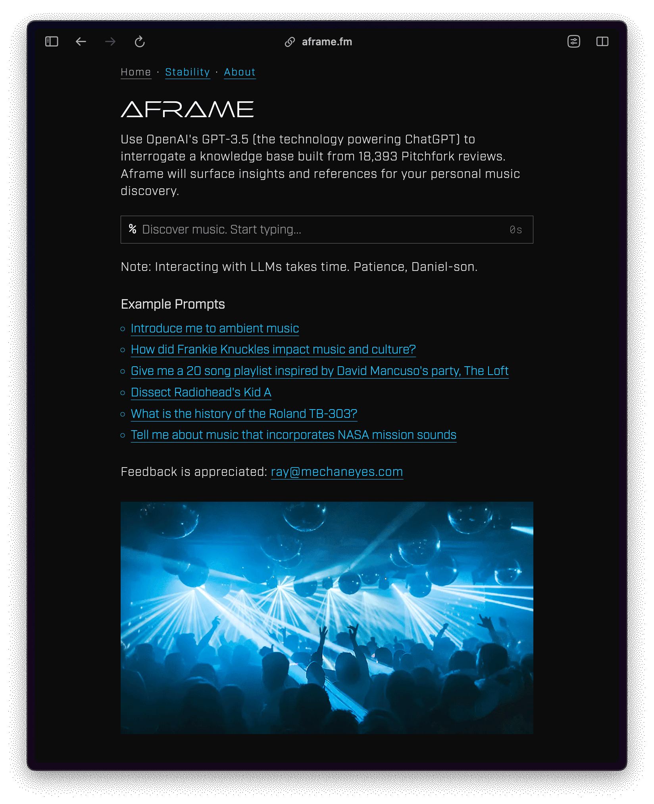
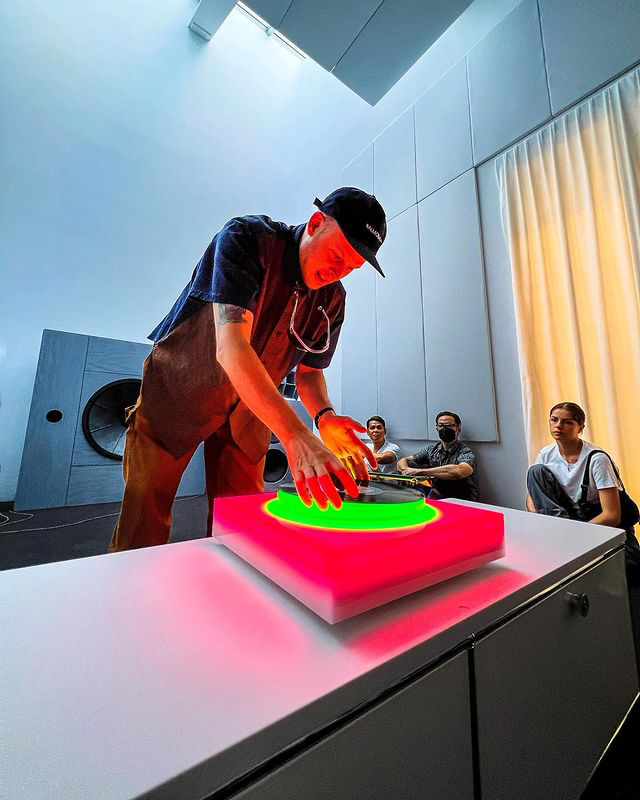

 

# https://aframe.fm/

 

# Aframe
*AI enabled exploration of music information*

### RAG
Aframe applies Retrieval Augmented Generation (RAG) to allow users to gain knowledge through interaction with GPT-3.5. The app references information derived from 18,393 Pitchfork.com album reviews written between Jan 5, 1999 and Jan 8, 2017. It's not the most recent data, but works for the purpose of this MVP.

### OpenAI embedding tools
I've used LangChain's OpenAI embedding tools leveraging the 'text-embedding-ada-002' embedding model to create a vector store then hosted on Pinecone.

When prompted I hit the vector database to find information from those album reviews which are then used to craft a prompt tailored for OpenAI's GPT-3.5. 

### GPT &middot; Next.js &middot; Flask
The calls to GPT-3.5 are managed through a Flask backend I've hosted on Vercel. That codebase is currently private as it's oozing with secret sauce. 

The Next.js frontend is also hosted on Vercel.

The response from GPT-3.5 is presented, and just below I've included links to the Pitchfork reviews that were used to generate the prompt and are used by you to corroborate the factually validity of the response.

#### No hallucination zone
What all this means is that the app is not allowed to hallucinate. If any, the factual inconsistencies come from Pitchfork. If the information isn't in that dataset, **which again cuts out at 2017**, the app will simply throw it's hands up and leave for the day.

### Stability.ai API
One element that may be easy to miss is the [Aframe v Stability AI](https://aframe.fm/stability) page. 

Here you see me make the same interaction with Pinecone and OpenAI, this time with an added call to request a 1 sentence summary of the general attitude of the original response. That sentence is then used as a prompt to the Stability.ai API and the SDXL model. The response from SDXL is an image based off the text, which I wanted so as to give the visitor a bit of respite from the inital wall of text. I'm quite happy with the way this plays out.

Oh, all of this ping pong between models is fairly slow. For that reason, the image is injected after the third paragraph of the text response. Patience please.

### it's a spiritual thing, a body thing, a soul thing
Isn't an a-frame a type of house? Well, yes. The Spotify DJ, which I'm enjoying these days, recently told me, "You like house. I get it."

## A parting soundtrack
And while we're on the subject of music &mdash;  we always are &mdash;  it's not the housiest of house but ...  
I'm obv from the 90s: [08 | Alex Kassian on Spotify](https://open.spotify.com/playlist/6jEf9vP6uMz6SnqEZT8vtt?si=e5ccbb0154554722)

## A parting pic

An image I made of Devon Turnbull at Lissen Gallery, here putting the final 12" from Brian Eno's *Music for Installations* on the very limited edition Brian Eno crafted, *Brian Eno Turntable, 2021*

[Devon Turnbull: HiFi Listening Room Dream No. 1 and other works](https://www.lissongallery.com/exhibitions/devon-turnbull-ojas-hifi-listening-room-dream-no-1)

